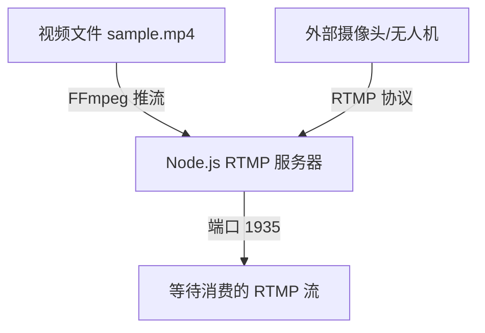
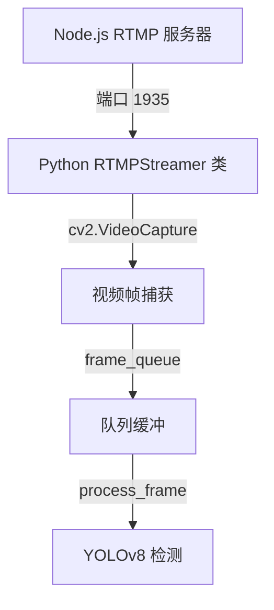
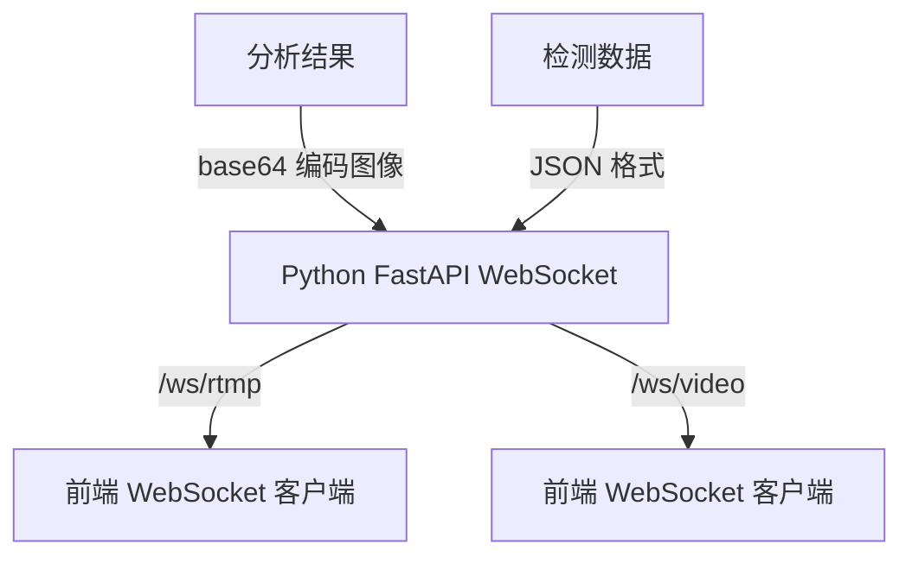
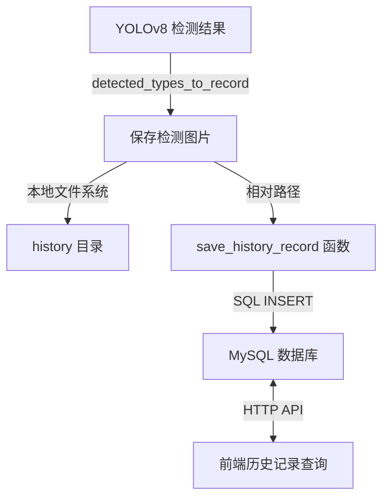
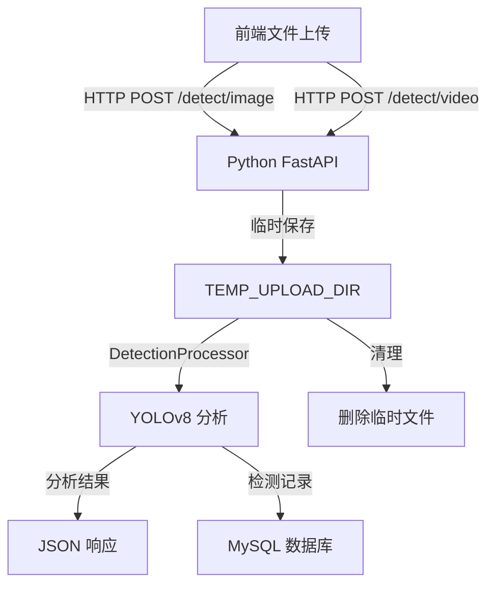

# sewageWatch 项目技术文档

## 1. 系统架构概述

sewageWatch 是一个多语言协同的污水监测系统，采用微服务架构设计，集成了实时视频分析、对象检测、数据存储和用户管理等功能模块。系统主要由四个核心组件组成，通过明确的数据流和接口进行交互。

### 1.1 系统组件架构

```
┌─────────────────────┐     ┌─────────────────────┐
│    前端界面层       │     │    视频采集与流层   │
│    (Vue 3)          │     │    (Node.js, FFmpeg)│
└──────────┬──────────┘     └──────────┬──────────┘
           │                           │
           ▼                           ▼
┌─────────────────────┐     ┌─────────────────────┐
│    业务逻辑层       │◄────►│    视频分析层       │
│    (Java Spring Boot)│     │    (Python FastAPI)│
└──────────┬──────────┘     └──────────┬──────────┘
           │                           │
           ▼                           ▼
┌─────────────────────────────────────────────┐
│                  数据存储层                  │
│              (MySQL 关系型数据库)             │
└─────────────────────────────────────────────┘
```

### 1.2 核心组件说明

| 组件             | 技术栈                | 主要职责                              | 端口号 | 部署路径                  |
|----------------|---------------------|----------------------------------|------|-----------------------|
| 前端界面           | Vue 3, Vite 6, Element Plus | 用户交互界面、实时视频监控、数据可视化              | 5173 | `Vue/`                 |
| 视频流服务器         | Node.js, node-media-server | RTMP 流接收与转发                     | 1935 | `Node.js/`             |
| 视频分析服务         | Python 3.9+, FastAPI, YOLOv8 | 视频处理、对象检测、WebSocket 实时流传输    | 8081 | `sewage-watch-Python/` |
| 业务逻辑服务         | Java 17, Spring Boot 3 | 用户管理、任务管理、权限控制、数据持久化           | 8080 | `sewage-watch-JAVA/`   |
| 数据库            | MySQL 8.0+          | 数据存储、查询、事务管理                    | 3306 | 外部服务                  |
| 视频源处理          | FFmpeg              | 视频文件推流至 RTMP 服务器                | -    | 系统环境变量               |

## 2. 数据流传输机制

### 2.1 实时视频数据流

实时视频数据流是整个系统的核心，遵循以下传输路径：

#### 2.1.1 视频源到 RTMP 服务器



- **技术实现**：
  - 在 `start.bat` 中通过以下命令启动视频推流：
    ```batch
    ffmpeg -re -stream_loop -1 -i "%BASE%\Node.js\sample.mp4" -c copy -f flv rtmp://localhost:1935/live/stream1
    ```
  - Node.js 服务器通过 `node-media-server` 库接收 RTMP 流：
    ```javascript
    const NodeMediaServer = require('node-media-server');
    const config = { rtmp: { port: 1935, chunk_size: 4096 } };
    const nms = new NodeMediaServer(config);
    nms.run();
    ```

#### 2.1.2 RTMP 流到视频分析服务



- **技术实现**：
  - Python 服务使用 `cv2.VideoCapture` 从 RTMP 服务器拉取视频流
  - 通过优化的 FFmpeg 参数提升 H.264 解码性能：
    ```python
    ffmpeg_options = {
        'rtsp_transport': 'tcp',
        'probesize': '10000000',
        'analyzeduration': '10000000',
        'flags': 'low_delay',
        'fflags': 'nobuffer+fastseek+flush_packets',
        'max_delay': '0',
        'thread_type': 'frame',
        'threads': '1',
        'err_detect': 'ignore_err',
        'skip_frame': 'nokey'
    }
    ```
  - 使用队列缓冲处理连接中断和网络波动：
    ```python
    self.frame_queue = queue.Queue(maxsize=config["buffer_size"])  # 默认为30帧
    ```

#### 2.1.3 视频分析结果到前端



- **技术实现**：
  - Python 服务提供两个 WebSocket 端点：
    - `/ws/video`：处理本地视频文件流
    - `/ws/rtmp`：处理 RTMP 视频流
  - 视频帧经过检测后，转换为 base64 编码并通过 WebSocket 发送：
    ```python
    _, buffer = cv2.imencode('.jpg', frame, [int(cv2.IMWRITE_JPEG_QUALITY), 80])
    frame_b64 = base64.b64encode(buffer).decode('utf-8')
    await websocket.send_json({
        "image": frame_b64,
        "fps": round(fps, 1),
        "speed": round(np.random.uniform(10, 15), 1),
        "weather": "晴朗",
        "source": "RTMP"
    })
    ```
  - 前端通过 Vue 组件接收并渲染实时视频流

### 2.2 数据存储与检索流

当系统检测到污染物时，会触发以下数据流程：



- **技术实现**：
  - 检测图片保存在配置的历史记录目录：
    ```python
    image_path = os.path.join(config["history_path"], filename)
    cv2.imwrite(image_path, annotated_frame)
    ```
  - 检测记录存储到 MySQL 数据库：
    ```python
    sql = """
    INSERT INTO history (taskId, type, src, createdTime)
    VALUES (%s, %s, %s, %s)
    """
    now = datetime.datetime.now()
    cursor.execute(sql, (task_id, type_name, image_path, now))
    ```
  - Python 服务通过 FastAPI 提供静态文件访问：
    ```python
    app.mount("/history", StaticFiles(directory=str(history_dir)), name="history")
    ```

### 2.3 文件上传与处理流

系统支持图片和视频文件上传进行离线分析：



- **技术实现**：
  - FastAPI 提供文件上传接口：
    ```python
    @app.post("/detect/image")
    async def detect_image(file: UploadFile = File(...)):
        # 处理上传的图片文件
        ...
    
    @app.post("/detect/video")
    async def detect_video(
        file: UploadFile = File(...),
        frame_interval: int = Form(30)
    ):
        # 处理上传的视频文件
        ...
    ```
  - 使用 `uuid` 生成唯一文件名避免冲突：
    ```python
    unique_filename = f"{uuid.uuid4().hex}_{file.filename}"
    ```
  - 处理完成后自动清理临时文件：
    ```python
    if file_path and os.path.exists(file_path):
        try:
            os.unlink(file_path)
        except Exception as e:
            logger.error(f"删除临时文件失败: {file_path}, 错误: {e}")
    ```

## 3. 核心功能模块详细设计

### 3.1 视频流处理模块

#### 3.1.1 本地视频流处理

- **功能说明**：处理本地视频文件，进行实时分析并通过 WebSocket 推送到前端
- **核心类**：`VideoStreamer`
- **关键方法**：
  - `initialize()`：初始化视频捕获
  - `process_frame()`：使用 YOLOv8 处理视频帧
  - `stream_video()`：流式传输处理后的视频帧
  - `send_frame()`：将帧编码并发送到客户端

#### 3.1.2 RTMP 流处理

- **功能说明**：从 RTMP 服务器拉取视频流，进行实时分析并推送到前端
- **核心类**：`RTMPStreamer`
- **关键方法**：
  - `initialize()`：初始化 RTMP 视频捕获
  - `capture_frames()`：在后台线程捕获 RTMP 帧
  - `process_frame()`：处理并分析视频帧
  - `start_capture()`：启动捕获线程
  - `stream_video()`：流式传输视频到 WebSocket 客户端

### 3.2 对象检测模块

- **功能说明**：使用 YOLOv8 模型检测视频中的污染物（如瓶子等）
- **核心技术**：
  - 模型路径：`public/yolov8n_7_11.pt`（针对污水监测优化的模型）
  - 置信度阈值：0.4
  - IOU 阈值：0.5
- **检测流程**：
  1. 加载 YOLOv8 模型
  2. 对输入帧进行推理
  3. 过滤并处理检测结果
  4. 在帧上绘制边界框和标签
  5. 记录检测到的污染物类型

### 3.3 WebSocket 通信模块

- **功能说明**：提供实时双向通信通道，推送处理后的视频流到前端
- **核心端点**：
  - `/ws/video`：本地视频流 WebSocket 端点
  - `/ws/rtmp`：RTMP 视频流 WebSocket 端点
- **通信协议**：
  - 消息格式：JSON
  - 图像数据：base64 编码的 JPEG 图像
  - 元数据：帧率(fps)、速度、天气等

### 3.4 数据持久化模块

- **功能说明**：负责系统数据的存储、查询和管理
- **核心数据表**：
  - `user`：用户信息表
  - `task`：任务管理表
  - `history`：检测历史记录表
- **数据访问**：
  - Python 服务：使用 pymysql 库直接访问数据库
  - Java 服务：使用 MyBatis 框架访问数据库

## 4. 系统配置与优化

### 4.1 配置文件

系统主要通过 `config.xml` 文件进行配置，包含以下关键配置项：
- RTMP 流 URL
- 视频缓冲大小、帧率、重连延迟等
- 数据库连接信息
- 历史记录存储路径
- 检测类型配置

### 4.2 性能优化策略

- **视频处理优化**：
  ```python
  # FFmpeg 优化参数
  ffmpeg_options = {
      'rtsp_transport': 'tcp',          # 强制使用TCP，保证数据传输可靠性
      'probesize': '10000000',        # 增加探测数据大小
      'analyzeduration': '10000000',  # 增加分析时长
      'flags': 'low_delay',             # 开启低延迟标志
      # ... 其他优化参数
  }
  ```

- **多线程处理**：
  ```python
  # RTMP 捕获在独立线程中进行
  self.capture_thread = threading.Thread(target=self.capture_frames, daemon=True)
  self.capture_thread.start()
  ```

- **队列缓冲机制**：
  ```python
  # 使用队列缓冲视频帧，处理网络波动
  self.frame_queue = queue.Queue(maxsize=config["buffer_size"])
  ```

## 5. 系统接口说明

### 5.1 WebSocket 接口

#### 5.1.1 `/ws/video`
- **功能**：获取本地视频流
- **参数**：无
- **返回格式**：JSON 消息，包含 base64 编码图像和元数据

#### 5.1.2 `/ws/rtmp`
- **功能**：获取 RTMP 视频流
- **参数**：`rtmp_url`（可选，RTMP 流地址）
- **返回格式**：JSON 消息，包含 base64 编码图像和元数据

### 5.2 HTTP API 接口

#### 5.2.1 `/detect/image`
- **功能**：上传并分析图片文件
- **方法**：POST
- **参数**：`file`（图片文件）
- **返回**：JSON 格式的检测结果

#### 5.2.2 `/detect/video`
- **功能**：上传并分析视频文件
- **方法**：POST
- **参数**：`file`（视频文件）、`frame_interval`（可选，帧间隔，默认30）
- **返回**：JSON 格式的检测结果

#### 5.2.3 `/history/{filename}`
- **功能**：访问历史检测图片
- **方法**：GET
- **返回**：图片文件

## 6. 部署与启动流程

### 6.1 启动流程

系统通过 `start.bat` 脚本统一启动所有服务：

1. 设置基础路径和日志目录
2. 定义各服务启动命令：
   - FFmpeg 视频推流
   - Node.js RTMP 服务器
   - Python 视频分析服务
   - Vue 前端开发服务器
   - Java 业务逻辑服务
3. 在后台启动所有服务，并将日志输出到统一的日志目录

```batch
REM 启动各服务并将日志输出到../logs目录
for %%S in (FFmpeg, Node, Python, Vue, Java) do (
    echo [%%S] 启动服务...
    start /B /MIN cmd /c "cd /d "%BASE%\!%%S_dir!" && !%%S_cmd! > "%LOG_DIR%\%%S.log" 2>&1"
)
```

### 6.2 停止流程

系统通过 `stop.bat` 脚本停止所有服务：

1. 定义需要检查的端口列表：1935, 5173, 8000, 8080, 8081
2. 检查每个端口的占用情况
3. 终止占用这些端口的进程

```batch
set "PORTS=1935 5173 8000 8080 8081"

for %%P in (%PORTS%) do (
    echo 检查端口 %%P 占用情况...
    netstat -ano | findstr /RC:":%%P\>" > nul
    
    if !errorlevel! neq 0 (
        echo [提示] 端口 %%P 未被占用
    ) else (
        for /f "tokens=5" %%I in ('netstat -ano ^| findstr /RC:":%%P\>"') do (
            echo [成功] 终止进程 PID: %%I (端口 %%P)
            taskkill /PID %%I /F /T > nul
        )
    )
)
```

## 7. 安全与权限

系统实现了基于角色的访问控制（RBAC）机制，不同角色拥有不同的操作权限：

- **ADMIN**：系统管理员，拥有所有操作权限
- **INSPECTOR**：巡检员，可以进行监控、任务管理等操作
- **PUBLIC**：普通用户，只能查看检测结果和历史记录

前端路由通过元数据配置权限控制：

```javascript
children: [
  {
    path: 'monitor',
    name: 'Monitor',
    component: () => import('../views/Monitor.vue'),
    meta: {
      requiresAuth: true,
      roles: ['INSPECTOR', 'ADMIN']
    }
  },
  // ... 其他路由
]
```

## 8. 扩展与维护

### 8.1 扩展方向

- 添加更多类型的污染物检测模型
- 集成更多视频源（如网络摄像头、无人机等）
- 实现更复杂的数据分析和预测功能
- 增加移动应用支持

### 8.2 维护建议

- 定期更新 YOLO 模型以提高检测准确率
- 监控系统性能，特别是视频处理部分的资源占用
- 定期清理历史记录，避免存储空间耗尽
- 备份数据库，防止数据丢失

### 8.3 常见问题排查

1. **RTMP 流连接失败**：
   - 检查 Node.js 服务器是否正常运行
   - 确认 FFmpeg 是否已正确安装和配置
   - 验证网络连接和防火墙设置

2. **视频分析性能问题**：
   - 调整 YOLO 模型的置信度阈值
   - 考虑使用更轻量级的模型
   - 增加视频处理的帧间隔

3. **数据库连接问题**：
   - 检查 `config.xml` 中的数据库配置
   - 确认 MySQL 服务是否正在运行
   - 验证用户权限和密码